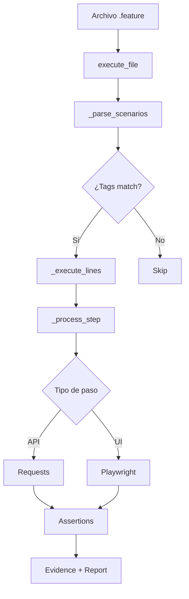

# 📚 PyRate Framework - Documentación Técnica Completa

> **Autor**: Rafael Enrique Alvarado García  
> **Versión**: 1.0.2  
> **Fecha**: Enero 2026  
> **Licencia**: MIT

---

## 🎯 Visión General del Proyecto

PyRate Framework es un **framework de automatización de pruebas híbrido** (API + UI) inspirado en Karate Framework pero construido completamente en Python. Combina la simplicidad de la sintaxis Gherkin con el poder de Python para crear pruebas legibles y mantenibles.

### Problema que Resuelve

**Antes de PyRate:**

- ❌ Frameworks separados para API (pytest+ requests) y UI (Selenium/Playwright)
- ❌ Código complejo para QA no programadores
- ❌ Generación manual de evidencias
- ❌ Falta de estandarización en reportes

**Después de PyRate:**

- ✅ Framework unificado API + UI
- ✅ Sintaxis natural (Gherkin) → QA sin Python pueden escribir tests
- ✅ Evidencias automáticas (DOCX + screenshots)
- ✅ Reportes HTML profesionales

---

## 🏗️ Arquitectura del Sistema

```
PyRate Framework
├── 📦 Núcleo del Framework
│   ├── core.py              → Motor de ejecución (PyRateRunner)
│   ├── assertions.py        → Sistema de validaciones
│   └── validators.py        → Validadores auxiliares
│
├── 🔧 Utilidades
│   ├── data_loader.py       → Carga datos (CSV/Excel/JSON)
│   ├── evidence.py          → Generador de evidencias
│   ├── report_generator.py → Generador de reportes HTML
│   └── logger.py            → Sistema de logging
│
├── ⚙️ Configuración
│   ├── config.py            → Clase PyRateConfig
│   └── config_loader.py     → Cargador de YAML
│
├── 🎮 Interfaz de Usuario
│   ├── cli.py               → Comandos CLI
│   └── __main__.py          → Entry point módulo
│
└── ⚠️ Excepciones
    └── exceptions.py        → Excepciones personalizadas
```

---

## 📦 Componente 1: Motor de Ejecución (`core.py`)

### Clase Principal: `PyRateRunner`

**Responsabilidad**: Orquestar la ejecución de archivos `.feature` con sintaxis Gherkin.

#### Flujo de Ejecución



#### Métodos Clave

##### 1. `__init__(tags=None, config=None)`

**Inicializa el runner con dependencias**

```python
def __init__(self, tags=None, config=None):
    self.tags = tags  # Filtro de tags (ej: "@smoke")
    self.config = config or PyRateConfig()

    # Estado interno
    self.variables = {}      # Variables globales (#(var))
    self.last_response = None  # Última respuesta API
    self.api_url = ""        # URL base
    self.headers = {}        # Headers HTTP

    # Playwright (UI)
    self.browser = None
    self.page = None

    # Reportes
    self.steps_log = []      # Log de pasos
    self.assertions = Assertions()
    self.evidence_gen = EvidenceGenerator()
```

**Arquitectura de Dependencias:**

- ✅ Inyección de dependencias (config opcional)
- ✅ Lazy initialization (browser se crea solo si necesario)
- ✅ Estado inmutable para variables

---

##### 2. `execute_file(file_path)`

**Entry point principal para ejecutar un archivo .feature**

```python
def execute_file(self, file_path):
    """
    1. Lee el archivo .feature
    2. Carga variables de entorno (.env)
    3. Parsea escenarios
    4. Ejecuta cada escenario
    5. Genera evidencias + reportes
    """
```

**Características Técnicas:**

- ✅ **Data-driven**: Detecta `Data source: archivo.csv`
- ✅ **Tag filtering**: Solo ejecuta escenarios con tags deseados
- ✅ **Error handling**: Try-catch por escenario (uno falla → otros continúan)
- ✅ **Cleanup**: Cierra browser automáticamente

---

##### 3. `_parse_scenarios(lines)`

**Parsea archivo .feature en escenarios individuales**

```python
# Entrada:
# @smoke @api
# Given url 'https://api.com'
# And path 'users'
# When method get

# Salida:
{
    'name': 'Scenario Auto',
    'tags': ['@smoke', '@api'],
    'lines': [
        "Given url 'https://api.com'",
        "And path 'users'",
        "When method get"
    ]
}
```

**Lógica de Parseo:**

1. Busca líneas que empiecen con `#` tags
2. Agrupa líneas hasta el próximo tag o fin de archivo
3. Retorna lista de dicts `{name, tags, lines}`

---

##### 4. `_execute_lines(lines, iteration_idx=1)`

**Ejecuta una lista de líneas Gherkin**

```python
for line in lines:
    line = self._inject_vars(line)  # ${var} → valor real

    step_record = {
        'name': line,
        'status': 'PASS',
        'error': None
    }

    try:
        self._process_step(line, step_record)
    except Exception as e:
        step_record['status'] = 'FAIL'
        step_record['error'] = str(e)
        raise
```

**Patrón de Diseño:**

- ✅ **Command Pattern**: Cada línea es un comando
- ✅ **Template Method**: Estructura común para API/UI

---

##### 5. `_process_step(line, step_record)`

**Núcleo del framework - procesa cada paso Gherkin**

**Categorías de Pasos:**

| Categoría         | Ejemplo                             | Acción                               |
| ----------------- | ----------------------------------- | ------------------------------------ |
| **API Base**      | `Given url 'https://api.com'`       | `self.api_url = valor`               |
| **API Path**      | `And path 'users/1'`                | `self.api_url += '/users/1'`         |
| **API Headers**   | `And header Auth = 'Bearer ...'`    | `self.headers['Auth'] = valor`       |
| **API Request**   | `And request {"name": "John"}`      | `self.request_body = valor`          |
| **HTTP Method**   | `When method get`                   | `requests.get(url, headers)`         |
| **Status Assert** | `Then status 200`                   | `assert response.status_code == 200` |
| **Match Assert**  | `And match response.name == 'John'` | `Assertions.match(...)`              |
| **UI Driver**     | `Given driver 'https://web.com'`    | Abre Playwright                      |
| **UI Input**      | `And input '#user' 'admin'`         | `page.fill('#user', 'admin')`        |
| **UI Click**      | `And click 'button'`                | `page.click('button')`               |
| **UI Wait**       | `And wait 3`                        | `time.sleep(3)`                      |

**Ejemplo de Procesamiento API:**

```python
# Paso: "When method post"
if "when method" in line.lower():
    method = line.split()[-1].upper()

    if method == "GET":
        response = requests.get(
            self.api_url,
            headers=self.headers,
            timeout=self.config.api_timeout
        )
    elif method == "POST":
        response = requests.post(
            self.api_url,
            json=self.request_body,
            headers=self.headers
        )

    self.last_response = response
    step_record['response_data'] = response.json()
```

**Ejemplo de Procesamiento UI:**

```python
# Paso: "And input '#username' 'admin'"
if "and input" in line.lower():
    match = re.search(r"input\s+'([^']+)'\s+'([^']+)'", line)
    selector = match.group(1)
    value = match.group(2)

    self.page.fill(selector, value)

    # Captura screenshot automática
    screenshot = self.page.screenshot()
    step_record['screenshot_bytes'] = screenshot
```

---

##### 6. `_inject_vars(line)`

**Inyecta variables en el texto**

```python
# Input: "And request {\"user\": \"#(username)\"}"
# Variables: {"username": "admin"}
# Output: "And request {\"user\": \"admin\"}"

def _inject_vars(self, line):
    while '#(' in line:
        start = line.index('#(')
        end = line.index(')', start)
        var_name = line[start+2:end]
        value = self.variables.get(var_name, '')
        line = line[:start] + str(value) + line[end+1:]
    return line
```

---

## 🎯 Componente 2: Sistema de Aserciones (`assertions.py`)

### Clase `Assertions`

**Responsabilidad**: Validar valores con soporte para fuzzy matchers.

#### Fuzzy Matchers Soportados

| Matcher    | Descripción       | Ejemplo                           |
| ---------- | ----------------- | --------------------------------- |
| `#notnull` | Valor no es nulo  | `assert valor is not None`        |
| `#null`    | Valor es nulo     | `assert valor is None`            |
| `#string`  | Tipo string       | `isinstance(valor, str)`          |
| `#number`  | Tipo numérico     | `isinstance(valor, (int, float))` |
| `#boolean` | Tipo booleano     | `isinstance(valor, bool)`         |
| `#array`   | Tipo lista        | `isinstance(valor, list)`         |
| `#object`  | Tipo dict         | `isinstance(valor, dict)`         |
| `#uuid`    | UUID válido       | Regex UUID v4                     |
| `#ignore`  | Omitir validación | Siempre pasa                      |

#### Implementación del Método `match()`

```python
@staticmethod
def match(actual, expected):
    # 1. Si es fuzzy matcher
    if isinstance(expected, str) and expected.startswith('#'):
        marker = expected.lower()

        if marker == '#notnull':
            assert actual is not None
            return

        if marker == '#uuid':
            uuid_regex = r'^[0-9a-f]{8}-[0-9a-f]{4}-...'
            assert re.match(uuid_regex, actual)
            return

    # 2. Comparación exacta
    if actual != expected:
        if str(actual) == str(expected):  # "200" vs 200
            return
        raise AssertionError(f"Expected {expected}, got {actual}")
```

**Patrón de Diseño:**

- ✅ **Strategy Pattern**: Diferentes estrategias para cada matcher
- ✅ **Static Method**: No necesita instancia

---

## 📄 Componente 3: Generación de Evidencias (`evidence.py`)

### Clase `EvidenceGenerator`

**Responsabilidad**: Crear archivos de evidencia para auditoría.

#### Tipos de Evidencia

##### 1. **Evidencia API** (Formato TXT)

```
========================================
REPORTE DE EJECUCIÓN API
========================================
Fecha/Hora: 2026-01-14 19:30:45
Escenario:  Login exitoso
Método:     POST
Iteración:  1
========================================

RESPONSE (JSON):
----------------
{
    "token": "eyJhbGciOiJIUzI1NiIsInR5cCI6",
    "user": {
        "id": 123,
        "name": "Admin"
    }
}
```

**Código:**

```python
def generate_api_evidence(self, scenario_name, method, response_data, iteration=0):
    timestamp = datetime.now().strftime("%Y-%m-%d %H:%M:%S")
    filename = f"API_{scenario_name}_Iter{iteration + 1}.txt"

    content = f"""
    REPORTE DE EJECUCIÓN API
    Fecha: {timestamp}
    Método: {method}
    RESPONSE: {json.dumps(response_data, indent=4)}
    """

    with open(filename, "w", encoding="utf-8") as f:
        f.write(content)
```

---

##### 2. **Evidencia UI** (Formato DOCX)

**Características:**

- ✅ Screenshots embedded
- ✅ Colores (verde OK, rojo FAIL)
- ✅ Timestamp de ejecución
- ✅ Detalles de errores

```python
def generate_ui_evidence(self, scenario_name, steps_log, iteration=0):
    doc = Document()
    doc.add_heading(f'Evidencia: {scenario_name}', 0)

    for step in steps_log:
        p = doc.add_paragraph()
        p.add_run(f"Paso: {step['name']}").bold = True

        if step['status'] == 'FAIL':
            run = p.add_run(" [FALLIDO]")
            run.font.color.rgb = RGBColor(255, 0, 0)  # Rojo
        else:
            run = p.add_run(" [OK]")
            run.font.color.rgb = RGBColor(0, 128, 0)  # Verde

        # Adjuntar screenshot
        if step.get('screenshot_bytes'):
            image_stream = BytesIO(step['screenshot_bytes'])
            doc.add_picture(image_stream, width=Inches(5.0))

    doc.save(f"UI_{scenario_name}.docx")
```

---

## 🔧 Componente 4: Cargador de Datos (`data_loader.py`)

**Responsabilidad**: Leer fuentes de datos para pruebas data-driven.

### Formatos Soportados

#### CSV

```python
def load_dataset(file_path):
    if file_path.endswith('.csv'):
        import pandas as pd
        df = pd.read_csv(file_path)
        return df.to_dict('records')
```

**Ejemplo:**

```csv
username,password
admin,pass123
user1,test456
```

**Retorna:**

```python
[
    {"username": "admin", "password": "pass123"},
    {"username": "user1", "password": "test456"}
]
```

#### Excel (`.xlsx`)

```python
if file_path.endswith('.xlsx'):
    df = pd.read_excel(file_path)
    return df.to_dict('records')
```

#### JSON

```python
if file_path.endswith('.json'):
    with open(file_path) as f:
        return json.load(f)
```

---

## 📊 Componente 5: Generador de Reportes (`report_generator.py`)

### Función `generate_report()`

**Salida**: HTML interactivo con:

- ✅ Dashboard de métricas
- ✅ Gráficos de paseFail
- ✅ Timeline de ejecución
- ✅ Links a evidencias

**Tecnologías Usadas:**

- Jinja2 para templating
- Chart.js (inline) para gráficos

---

## ⚙️ Componente 6: Sistema de Configuración

### Clase `PyRateConfig` (`config.py`)

```python
@dataclass
class PyRateConfig:
    # Browser
    headless: bool = False
    browser_timeout: int = 30000

    # API
    api_timeout: int = 30
    verify_ssl: bool = True
    retry_attempts: int = 1

    # Evidence
    evidence_folder: str = "evidence"
    screenshot_on_pass: bool = True

    # Reports
    reports_folder: str = "reports"
```

### Cargador YAML (`config_loader.py`)

```python
class ConfigLoader:
    @staticmethod
    def load(config_file=None):
        if config_file and os.path.exists(config_file):
            with open(config_file) as f:
                data = yaml.safe_load(f)
                return PyRateConfig(**data['pyrate'])

        # Fallback a defaults
        return PyRateConfig()
```

---

## 🎮 Componente 7: CLI (`cli.py`)

### Entry Point: `main()`

```python
def main():
    parser = argparse.ArgumentParser(
        description="PyRate Framework CLI"
    )

    parser.add_argument('-v', '--version', action='version')
    subparsers = parser.add_subparsers(dest="command")

    # pyrate init
    subparsers.add_parser("init")

    # pyrate run <file>
    run_parser = subparsers.add_parser("run")
    run_parser.add_argument("file")
    run_parser.add_argument("-t", "--tags")
    run_parser.add_argument("-c", "--config")

    args = parser.parse_args()

    if args.command == "run":
        config = ConfigLoader.load(args.config)
        runner = PyRateRunner(tags=args.tags, config=config)
        runner.execute_file(args.file)
```

---

## 🚀 Flujo Completo de Ejecución

```
Usuario ejecuta:
$ pyrate run tests/login.feature -t @smoke

↓

cli.py → main()
  ↓
  Parsea argumentos
  ↓
  Carga configuración (YAML o defaults)
  ↓
  Crea PyRateRunner(tags="@smoke", config=...)
  ↓

core.py → execute_file("tests/login.feature")
  ↓
  Lee archivo .feature
  ↓
  _parse_scenarios() → [{name, tags, lines}, ...]
  ↓
  Filtra por tags (@smoke)
  ↓
  Para cada escenario:
    _execute_lines(scenario['lines'])
      ↓
      Para cada línea:
        _inject_vars(line)  # ${var} → valor
        _process_step(line, step_record)
          ↓
          ¿API o UI?
          ↓
          API: requests.get/post/...
          UI: playwright.fill/click/...
          ↓
          assertions.match(actual, expected)
          ↓
          evidence_gen.generate_*_evidence()
  ↓
  report_generator.generate_report(steps_log)
  ↓
  Cleanup (cierra browser)

↓

Usuario ve:
✅ Evidencias en /evidence/
✅ Reporte HTML en /reports/ultimo_reporte.html
```

---

## 🔑 Conceptos Clave de Diseño

### 1. **Separation of Concerns**

- `core.py` → Lógica de ejecución
- `assertions.py` → Validaciones
- `evidence.py` → Generación de archivos
- Cada clase tiene UNA responsabilidad

### 2. **Dependency Injection**

```python
runner = PyRateRunner(config=my_config)
# No hardcoded, inyección explícita
```

### 3. **Extensibilidad**

- Nuevos fuzzy matchers → Agregar en `assertions.py`
- Nuevos formatos de datos → Agregar en `data_loader.py`
- Nuevos comandos CLI → Agregar subparser en `cli.py`

### 4. **Error Resilience**

```python
try:
    self._process_step(line, step_record)
except Exception as e:
    step_record['status'] = 'FAIL'
    # Escenario falla pero otros continúan
```

---

## 📦 Distribución y Packaging

### `setup.py` Explicado

```python
setup(
    name="pyrate-framework",
    version="1.0.2",
    packages=find_packages(exclude=["tests*"]),  # Solo paquete pyrate/

    install_requires=[
        "requests>=2.28.0",     # API testing
        "playwright>=1.40.0",   # UI testing
        "pandas>=2.0.0",        # Data loading
        "python-docx>=1.0.0",   # DOCX evidence
    ],

    entry_points={
        'console_scripts': [
            'pyrate=pyrate.cli:main',  # Crea comando 'pyrate'
        ],
    },
)
```

### `__main__.py` Explicado

```python
# Permite: python -m pyrate --version
from .cli import main

if __name__ == "__main__":
    main()
```

---

## 🧪 Testing del Framework

### Ejemplo de Test Unitario

```python
def test_fuzzy_matcher_notnull():
    # Arrange
    actual = "algún valor"
    expected = "#notnull"

    # Act & Assert
    Assertions.match(actual, expected)  # No debe lanzar error

def test_fuzzy_matcher_fails():
    with pytest.raises(AssertionError):
        Assertions.match(None, "#notnull")
```

---

## 🎓 Conclusión

PyRate Framework es un ejemplo de **arquitectura modular bien diseñada**:

✅ **Bajo Acoplamiento**: Cada módulo es independiente  
✅ **Alta Cohesión**: Cada clase tiene responsabilidad clara  
✅ **Extensible**: Fácil agregar features  
✅ **Testeable**: Componentes aislados  
✅ **Mantenible**: Código limpio y documentado

**Tecnologías Core:**

- Python 3.8+
- Requests (API)
- Playwright (UI)
- Pandas (Data)
- python-docx (Evidence)
- Jinja2 (Reporting)

**Patrones de Diseño Aplicados:**

- Command Pattern (pasos Gherkin)
- Strategy Pattern (fuzzy matchers)
- Template Method (ejecución de pasos)
- Dependency Injection (configuración)

---

**Documento creado con ❤️ para entender cada línea de PyRate Framework**
