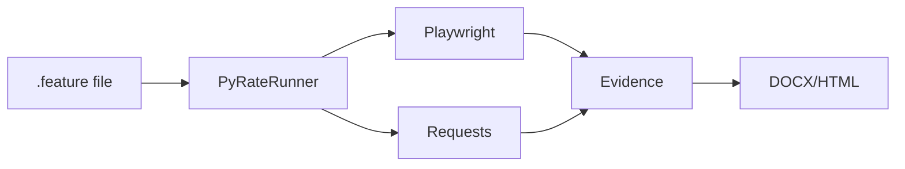

# 🎨 PyRate Framework - Pitch Deck Design Guide

> **Plataforma Recomendada**: Canva Pro (templates profesionales) o Google Slides  
> **Dimensiones**: 16:9 (1920x1080px)  
> **Duración Presentación**: 7-10 minutos

---

## 🎨 **Sistema de Diseño Global**

### Paleta de Colores

```css
/* Colores Principales */
--primary-green: #00c853; /* Success, Innovation */
--primary-blue: #2196f3; /* Tech, Trust */
--accent-yellow: #ffc107; /* Highlights */
--dark-bg: #1a1a1a; /* Backgrounds oscuros */
--light-text: #ffffff; /* Texto sobre oscuro */
--gray-text: #b0bec5; /* Texto secundario */

/* Colores de Apoyo */
--error-red: #f44336; /* Para comparativas "antes" */
--success-green: #4caf50; /* Para checkmarks */
--code-bg: #263238; /* Backgrounds de código */
```

### Tipografías

**Headers:**

- Fuente: **Inter Black** (Google Fonts)
- Peso: 900
- Color: `#FFFFFF` o `#00C853`

**Body Text:**

- Fuente: **Roboto Regular**
- Peso: 400
- Tamaño: 18-24px
- Color: `#E0E0E0`

**Code Snippets:**

- Fuente: **Fira Code**
- Color fondo: `#263238`
- Color texto: `#A5D6A7` (verde claro)

### Íconos

- Biblioteca: **Material Icons** o **Heroicons**
- Estilo: Outline (no filled)
- Color: `#00C853` o `#2196F3`

---

## 📊 **Slide 1: Portada**

### Layout

```
┌─────────────────────────────────────────┐
│                                         │
│         🚀 [LOGO PLACEHOLDER]           │
│                                         │
│         PyRate Framework                │
│                                         │
│   "Automatización de Pruebas en         │
│        Lenguaje Natural"                │
│                                         │
│   API • UI • Python • Gherkin           │
│                                         │
│   Rafael Alvarado García                │
│   Hackathon 2026                        │
│                                         │
└─────────────────────────────────────────┘
```

### Especificaciones

**Background:**

- Gradiente diagonal: `#1A1A1A` → `#263238`
- Overlay: Patrón de código difuminado al 10% de opacidad

**Título Principal:**

```
PyRate Framework
---
Font: Inter Black
Size: 72px
Color: #00C853
Letter spacing: -2px
```

**Tagline:**

```
"Automatización de Pruebas en Lenguaje Natural"
---
Font: Roboto Light Italic
Size: 32px
Color: #B0BEC5
```

**Tags (API • UI • Python):**

```
Font: Roboto Medium
Size: 20px
Color: #2196F3
Background: Píldoras con border-radius 20px
Padding: 8px 16px
```

**Autor:**

```
Rafael Alvarado García
---
Font: Roboto Regular
Size: 18px
Color: #E0E0E0
Position: Bottom right
```

**Elementos Visuales:**

- Logo PyRate centrado arriba (si tienes)
- Ícono Python sutil en esquina superior derecha
- Ícono Playwright en esquina inferior izquierda

---

## 📊 **Slide 2: El Problema**

### Layout

```
┌─────────────────────────────────────────┐
│  ❌ Automatización Actual es Compleja   │
├─────────────────────────────────────────┤
│                                         │
│  [DIAGRAM: Herramientas Desconectadas]  │
│                                         │
│  ┌─────┐  ┌─────┐  ┌─────┐             │
│  │pytest│  │Selen│  │Postm│             │
│  └─────┘  └─────┘  └─────┘             │
│      ❌       ❌       ❌                │
│                                         │
│  📊 Problemas Principales:              │
│                                         │
│  • Frameworks separados                 │
│  • 100+ líneas/test                     │
│  • Evidencias manuales                  │
│  • Solo para seniors                    │
│                                         │
│  💰 Costo: $80/hr QA Automation         │
│  ⏱️ Setup: 3-5 días capacitación        │
│                                         │
└─────────────────────────────────────────┘
```

### Especificaciones

**Header:**

```
❌ Automatización Actual es Compleja
---
Font: Inter Bold
Size: 48px
Color: #F44336 (rojo error)
Background: Barra superior oscura #212121
```

**Diagrama Central:**

- 3 cajas representando herramientas
- Usar logos reales: pytest, Selenium, Postman
- Flechas rojas cruzadas entre ellas (desconexión)
- Tamaño cajas: 150x150px

**Lista de Problemas:**

```
Font: Roboto Regular
Size: 24px
Color: #E0E0E0
Line height: 1.8
Icon color: #F44336
```

**Métricas (Costo/Setup):**

```
Font: Roboto Bold
Size: 20px
Color: #FFC107 (amarillo warning)
Icon: 💰 ⏱️
```

**Elementos Visuales:**

- Ícono de "warning" en esquina superior derecha
- Gráfico de barras pequeño mostrando "100+ líneas código"

---

## 📊 **Slide 3: La Solución**

### Layout

```
┌─────────────────────────────────────────┐
│  ✅ PyRate: Framework Híbrido            │
├─────────────────────────────────────────┤
│                                         │
│   ┌──────────────────────────────┐     │
│   │  ANTES (Selenium)            │     │
│   │  ───────────────             │     │
│   │  def test_login():           │     │
│   │    driver = webdriver...     │     │
│   │    driver.get('url')         │     │
│   │    driver.find...send_keys   │     │
│   │    # ... 7 líneas más        │     │
│   └──────────────────────────────┘     │
│                                         │
│            ⬇️  TRANSFORMA EN             │
│                                         │
│   ┌──────────────────────────────┐     │
│   │  AHORA (PyRate)              │     │
│   │  ──────────────              │     │
│   │  Given driver 'url'          │     │
│   │  And input '#user' 'admin'   │     │
│   │  And click 'button'          │     │
│   │  Then match text 'Welcome'   │     │
│   └──────────────────────────────┘     │
│                                         │
│   🎯 4 líneas vs 10 → 60% menos código  │
│                                         │
└─────────────────────────────────────────┘
```

### Especificaciones

**Header:**

```
✅ PyRate: Framework Híbrido
---
Font: Inter Bold
Size: 48px
Color: #00C853 (verde success)
```

**Código "Antes":**

```
Background: #263238 (oscuro)
Font: Fira Code
Size: 16px
Color: #FF5252 (rojo código "malo")
Border: 2px solid #F44336
Border-radius: 8px
Padding: 20px
```

**Código "Ahora":**

```
Background: #1B5E20 (verde oscuro)
Font: Fira Code
Size: 16px
Color: #A5D6A7 (verde claro)
Border: 2px solid #00C853
Border-radius: 8px
Padding: 20px
Shadow: 0 4px 20px rgba(0,200,83,0.3) (glow verde)
```

**Flecha Transformación:**

- Tamaño: 48px
- Color: #FFC107
- Animación: Pulso suave

**Métrica Final:**

```
🎯 60% menos código
---
Font: Roboto Bold
Size: 28px
Color: #00C853
Background: Píldora con border-radius
```

---

## 📊 **Slide 4: Features Clave**

### Layout

```
┌─────────────────────────────────────────┐
│  ✨ Características Principales          │
├─────────────────────────────────────────┤
│                                         │
│  ┌──────┐  ┌──────┐  ┌──────┐         │
│  │  🌐  │  │  📝  │  │  📄  │         │
│  │ API+ │  │Gherkin│  │Evidence│       │
│  │  UI  │  │Syntax │  │ Auto  │         │
│  └──────┘  └──────┘  └──────┘         │
│                                         │
│  ┌──────┐  ┌──────┐  ┌──────┐         │
│  │  🎯  │  │  📊  │  │  ⚡  │         │
│  │Fuzzy │  │HTML  │  │Data  │         │
│  │Matchers│ │Reports│ │Driven│         │
│  └──────┘  └──────┘  └──────┘         │
│                                         │
└─────────────────────────────────────────┘
```

### Especificaciones

**Cards de Features (6 total):**

```
Dimensiones: 300x250px
Background: Linear gradient #2A2A2A → #1F1F1F
Border: 1px solid #2196F3
Border-radius: 16px
Padding: 24px
Shadow: 0 8px 24px rgba(0,0,0,0.4)

Hover effect:
  - Elevar 8px
  - Border color: #00C853
  - Shadow más pronunciada
```

**Íconos:**

```
Size: 64px
Color: #2196F3
Position: Centrado arriba en cada card
```

**Título de Feature:**

```
Font: Inter Bold
Size: 24px
Color: #FFFFFF
Align: Center
```

**Descripción (si cabe):**

```
Font: Roboto Regular
Size: 16px
Color: #B0BEC5
Align: Center
```

**Lista de Features:**

1. 🌐 API + UI Híbrido
2. 📝 Sintaxis Gherkin Natural
3. 📄 Evidencias Automáticas
4. 🎯 Fuzzy Matchers
5. 📊 Reportes HTML
6. ⚡ Data-Driven

---

## 📊 **Slide 5: Demo en Vivo**

### Layout

```
┌─────────────────────────────────────────┐
│  🎬 Demostración en Vivo                 │
├─────────────────────────────────────────┤
│                                         │
│  [AQUÍ SALES DE LA PRESENTACIÓN]        │
│  [Y HACES EL DEMO EN TERMINAL]          │
│                                         │
│  Si falla el demo, mostrar:            │
│                                         │
│  ┌─────────────────────────────┐       │
│  │ [SCREENSHOT PRE-GRABADO]    │       │
│  │                             │       │
│  │ Terminal ejecutando:        │       │
│  │ $ pyrate run demo.feature   │       │
│  │                             │       │
│  │ ✅ 2/2 tests passed         │       │
│  │ 📄 Evidence generated       │       │
│  │ 📊 Report: ultimo_reporte.html│     │
│  └─────────────────────────────┘       │
│                                         │
└─────────────────────────────────────────┘
```

### Especificaciones

**Opción 1 (Demo Live):**

- Slide completamente negra
- Solo texto grande centrado:
  ```
  🎬 Demostración en Vivo
  Font: Inter Black
  Size: 72px
  Color: #00C853
  ```

**Opción 2 (Backup Screenshot):**

- Screenshot de terminal
- Aplicar filtro overlay verde (#00C853 al 10%)
- Border: 4px solid #00C853
- Caption abajo: "Ejecución exitosa en 3 segundos"

**Elementos a Capturar en Screenshot:**

1. Comando `pyrate run demo.feature`
2. Output con checkmarks verdes ✅
3. Paths a evidencias generadas
4. Tiempo de ejecución

---

## 📊 **Slide 6: Arquitectura Técnica**

### Layout

```
┌─────────────────────────────────────────┐
│  🏗️ Stack Tecnológico                    │
├─────────────────────────────────────────┤
│                                         │
│    Core Technologies                    │
│    ────────────────                    │
│    🐍 Python 3.8+                       │
│    🎭 Playwright  ──┐                   │
│    📡 Requests      │→ [PyRateRunner]  │
│    🐼 Pandas        │                   │
│    📝 python-docx  ─┘                   │
│                                         │
│    Key Features                         │
│    ────────────                        │
│    ✅ Custom Gherkin Parser             │
│    ✅ Fuzzy Matchers (#notnull, #uuid)  │
│    ✅ DOCX Evidence Generator           │
│    ✅ HTML Reports (Jinja2 + Chart.js)  │
│                                         │
└─────────────────────────────────────────┘
```

### Especificaciones

**Diagrama de Arquitectura:**



**Convertir a imagen:**

- Usar https://mermaid.live
- Export como PNG
- Tamaño: 800x400px
- Background transparente

**Logos de Tecnologías:**

- Python: Logo oficial
- Playwright: Logo oficial
- Requests: Ícono HTTP
- Tamaño: 48x48px
- Alineación: Horizontal con espacio 20px

**Checkmarks de Features:**

```
Icon: ✅
Color: #00C853
Font: Roboto Medium
Size: 20px
Spacing: 16px entre items
```

---

## 📊 **Slide 7: Casos de Uso**

### Layout

```
┌─────────────────────────────────────────┐
│  🎯 ¿Quién lo Usa?                       │
├─────────────────────────────────────────┤
│                                         │
│  ┌──────────────┐  ┌──────────────┐    │
│  │   👥 QA      │  │   🚀 Startups│    │
│  │   Teams      │  │              │    │
│  │              │  │   CI/CD Auto │    │
│  │ Tests más    │  │              │    │
│  │ rápidos      │  │              │    │
│  └──────────────┘  └──────────────┘    │
│                                         │
│  ┌──────────────┐  ┌──────────────┐    │
│  │   🎓 Edu     │  │   💼 Consult │    │
│  │   cación     │  │   orías      │    │
│  │              │  │              │    │
│  │ Enseñar      │  │ Entregas     │    │
│  │ sin Python   │  │ profesionales│    │
│  └──────────────┘  └──────────────┘    │
│                                         │
└─────────────────────────────────────────┘
```

### Especificaciones

**Cards de Casos de Uso:**

```
Dimensiones: 400x300px
Background: #1F1F1F
Border-left: 4px solid #00C853
Border-radius: 12px
Padding: 32px
```

**Emojis de Personas:**

```
Size: 72px
Position: Top center de cada card
Margin-bottom: 16px
```

**Título de Caso:**

```
Font: Inter Bold
Size: 28px
Color: #FFFFFF
```

**Descripción:**

```
Font: Roboto Regular
Size: 18px
Color: #B0BEC5
Line-height: 1.6
```

**4 Casos de Uso:**

1. 👥 **QA Teams** → "Tests 4x más rápidos"
2. 🚀 **Startups** → "CI/CD automatizado sin fricción"
3. 🎓 **Educación** → "Enseñar testing sin programación avanzada"
4. 💼 **Consultorías** → "Evidencias profesionales para clientes"

---

## 📊 **Slide 8: Métricas de Impacto**

### Layout

```
┌─────────────────────────────────────────┐
│  📈 Resultados Reales                    │
├─────────────────────────────────────────┤
│                                         │
│   ┌────────────────────────────┐       │
│   │  ⚡ 4x                      │       │
│   │  más rápido                │       │
│   │  crear tests               │       │
│   └────────────────────────────┘       │
│                                         │
│   ┌────────────────────────────┐       │
│   │  📉 70%                     │       │
│   │  menos código               │       │
│   └────────────────────────────┘       │
│                                         │
│   ┌────────────────────────────┐       │
│   │  ✅ 100%                    │       │
│   │  cobertura evidencias       │       │
│   └────────────────────────────┘       │
│                                         │
│   ┌────────────────────────────┐       │
│   │  🎓 1 día                   │       │
│   │  capacitación (vs 5)        │       │
│   └────────────────────────────┘       │
│                                         │
└─────────────────────────────────────────┘
```

### Especificaciones

**Metric Cards:**

```
Dimensions: 500x180px
Background: Linear gradient 45deg
  - Card 1: #1B5E20 → #2E7D32 (verde)
  - Card 2: #0D47A1 → #1976D2 (azul)
  - Card 3: #E65100 → #F57C00 (naranja)
  - Card 4: #4A148C → #6A1B9A (morado)
Border-radius: 16px
Shadow: 0 12px 32px rgba(0,0,0,0.3)
Padding: 32px
```

**Número Grande:**

```
Font: Inter Black
Size: 96px
Color: #FFFFFF
Letter-spacing: -4px
Text-shadow: 0 4px 12px rgba(0,0,0,0.5)
```

**Descripción:**

```
Font: Roboto Medium
Size: 24px
Color: rgba(255,255,255,0.9)
```

**Ícono a la izquierda:**

```
Size: 64px
Color: rgba(255,255,255,0.3)
Position: Absolute, left: 24px, top: 24px
```

---

## 📊 **Slide 9: Roadmap**

### Layout

```
┌─────────────────────────────────────────┐
│  🛣️ Próximos Pasos                       │
├─────────────────────────────────────────┤
│                                         │
│  ━━━━━━━━━━━━━━━━━━━━━━━━━━━━━━        │
│  │                                       │
│  v1.1 (Q2 2026)                         │
│  • Ejecución paralela                   │
│  • GraphQL support                      │
│  • TestRail integration                 │
│  │                                       │
│  ━━━━━━━━━━━━━━━━━━━━━━━━━━━━━━        │
│  │                                       │
│  v1.2 (Q3 2026)                         │
│  • Mock server integrado                │
│  • Visual regression testing            │
│  • Cloud execution (AWS Lambda)         │
│  │                                       │
│  ━━━━━━━━━━━━━━━━━━━━━━━━━━━━━━        │
│  │                                       │
│  v2.0 (Q4 2026)                         │
│  • AI-powered test generation           │
│  • Self-healing selectors               │
│  │                                       │
│  ━━━━━━━━━━━━━━━━━━━━━━━━━━━━━━        │
│                                         │
└─────────────────────────────────────────┘
```

### Especificaciones

**Timeline Vertical:**

```
Line color: #2196F3
Line width: 4px
Dots color: #00C853
Dot size: 24px
```

**Version Headers:**

```
Font: Inter Bold
Size: 32px
Color: #00C853
Background: Píldora con #1F1F1F
Padding: 8px 24px
Border-radius: 20px
```

**Feature Items:**

```
Font: Roboto Regular
Size: 20px
Color: #E0E0E0
Bullet: • (bullet unicode)
Line-height: 1.8
Margin-left: 48px
```

**Timeline Animation (si es digital):**

- Aparecer progresivamente de arriba hacia abajo
- Delay: 0.3s entre versiones

---

## 📊 **Slide 10: Call to Action**

### Layout

```
┌─────────────────────────────────────────┐
│                                         │
│       🌟 Únete al Proyecto               │
│                                         │
│  ┌─────────────────────────────────┐   │
│  │  📦 PyPI                        │   │
│  │  pip install pyrate-framework   │   │
│  └─────────────────────────────────┘   │
│                                         │
│  ┌─────────────────────────────────┐   │
│  │  🔗 GitHub                      │   │
│  │  rockefeller2021/PyRateFramework│   │
│  │  Test                           │   │
│  └─────────────────────────────────┘   │
│                                         │
│  ┌─────────────────────────────────┐   │
│  │  📧 Contacto                    │   │
│  │  magomlg@gmail.com              │   │
│  └─────────────────────────────────┘   │
│                                         │
│     ⭐ Star en GitHub               │
│     🤝 Contribuye con PRs           │
│     💬 Únete a la comunidad         │
│                                         │
│     [QR CODE]                          │
│                                         │
└─────────────────────────────────────────┘
```

### Especificaciones

**Header:**

```
🌟 Únete al Proyecto
Font: Inter Black
Size: 64px
Color: #00C853
Align: Center
```

**Command Boxes:**

```
Background: #263238 (código)
Font: Fira Code
Size: 24px
Color: #A5D6A7
Border: 2px solid #00C853
Border-radius: 12px
Padding: 24px
Width: 800px
Center align
```

**Sección de Copying:**

- Botón "Copiar" a la derecha de cada comando
- Color: #2196F3
- Hover: #00C853

**Action Items (Star, Contribuye, Únete):**

```
Font: Roboto Medium
Size: 28px
Color: #FFFFFF
Icon size: 40px
Spacing: 32px vertical
```

**QR Code:**

- Link a: GitHub repo
- Size: 250x250px
- Border: 4px solid #00C853
- Caption: "Escanea para GitHub"

---

## 🎬 **Transiciones y Animaciones**

### Transiciones Entre Slides

**Sugerencia 1 - Fade + Slide:**

```
Duration: 0.8s
Easing: Ease-in-out
Direction: Left to right
```

**Sugerencia 2 - Zoom:**

```
Duration: 0.6s
Scale from: 0.95
Scale to: 1.0
Opacity: 0 → 1
```

### Animaciones de Elementos

**Títulos:**

- Fade in desde arriba
- Delay: 0.2s
- Duration: 0.6s

**Contenido:**

- Fade in con slide up
- Delay: 0.4s
- Duration: 0.8s

**Métricas/Números:**

- Counter animation (0 → valor final)
- Duration: 1.5s
- Easing: Ease-out

---

## 📸 **Assets Necesarios**

### Imágenes a Crear/Buscar

1. **Logo PyRate** (si no exists)

   - Usar: Python logo + icono de cohete 🚀
   - Colores: #00C853 + #2196F3
   - Formato: PNG transparente
   - Tamaño: 512x512px

2. **Screenshot Terminal**

   - Comando: `pyrate run demo.feature`
   - Output con colores
   - Resolución: 1920x1080px

3. **Screenshot Evidencia DOCX**

   - Abrir evidencia generada
   - Capturar página con screenshot
   - Highlight importante con border verde

4. **Screenshot Reporte HTML**

   - Dashboard completo
   - Gráficos visibles
   - Captura full page

5. **Logos Tecnologías:**
   - Python (oficial)
   - Playwright (oficial)
   - Requests (ícono HTTP)
   - Todos 256x256px PNG transparente

### Íconos de Heroicons (gratis)

Descargar de: https://heroicons.com/

```
✅ check-circle (outline)
❌ x-circle (outline)
🚀 rocket-launch (outline)
📊 chart-bar (outline)
🎯 target (outline)
⚡ bolt (outline)
```

---

## 🛠️ **Tutorial Canva Rápido**

### Paso 1: Setup Inicial

1. Ir a **Canva.com**
2. Click **"Crear diseño"**
3. Seleccionar **"Presentación (16:9)"**
4. Dimensiones: 1920x1080px

### Paso 2: Configurar Tema

1. Click en **"Estilos"** (barra izquierda)
2. Crear **"Paleta de colores"**:
   - Agregar: `#00C853`, `#2196F3`, `#FFC107`, `#1A1A1A`
3. Configurar **"Fuentes del proyecto"**:
   - Headers: Inter Black
   - Body: Roboto Regular
   - Code: Source Code Pro (alternativa a Fira Code)

### Paso 3: Crear Slide Master

1. Crear primer slide con diseño base:
   - Background: `#1A1A1A`
   - Header bar: `#212121`
   - Footer con número de página
2. **"Duplicar"** este slide para cada uno de los 10

### Paso 4: Agregar Contenido

**Por Slide:**

1. Copy-paste texto de este documento
2. Aplicar estilos según especificaciones
3. Agregar íconos desde Canva Elements
4. Insertar imágenes/screenshots

### Paso 5: Exportar

1. Click **"Compartir"** → **"Descargar"**
2. Formato: **PDF estándar** (para presentar)
3. O **PowerPoint PPTX** (para editar después)

---

## 🎨 **Alternativa: Google Slides**

Si prefieres Google Slides (gratis, colaborativo):

### Template Recomendado

1. Usar **"Dark Modern"** template
2. Modificar colores master a nuestra paleta
3. Importar fuentes de Google Fonts:
   - Inter: https://fonts.google.com/specimen/Inter
   - Roboto: https://fonts.google.com/specimen/Roboto

### Ventajas Google Slides

✅ Colaboración en tiempo real
✅ Auto-save en la nube
✅ Presenter view con notas
✅ Gratuito

---

## 🚀 **Checklist Final Pre-Presentación**

**Diseño:**

- [ ] Todas las fuentes consistentes
- [ ] Colores de paleta aplicados
- [ ] Sin typos en texto
- [ ] Screenshots de alta calidad
- [ ] Logos en alta resolución

**Contenido:**

- [ ] Números/métricas correctos
- [ ] Links funcionales (GitHub, PyPI)
- [ ] Código sin errores de sintaxis
- [ ] QR code testeado

**Técnico:**

- [ ] PDF exportado y probado
- [ ] Backup en USB + Google Drive
- [ ] Versión PPTX por si necesitas editar
- [ ] Demo preparado (plan B si falla live)

**Ensayo:**

- [ ] Practicar transiciones
- [ ] Timing de 7-10 min
- [ ] Identificar slides "ancla" donde puedes extender/acortar

---

## 💡 **Tips Pro para Canva**

### Atajos de Teclado

```
Ctrl + D  = Duplicar elemento
Ctrl + Z  = Deshacer
Ctrl + /  = Buscar elementos
Ctrl + L  = Alinear izquierda
Ctrl + E  = Centrar horizontal
```

### Plugins Útiles

- **Unsplash** → Fotos de stock profesionales
- **GIPHY** → GIFs animados (para slides digitales)
- **Flaticon** → Íconos vectoriales
- **Gradient** → Generador de gradientes

### Elementos "Magic" de Canva

- **Magic Write** → Generar texto con IA
- **Magic Resize** → Adaptar a diferentes formatos
- **Background Remover** → Quitar fondos de imágenes

---

**¡Tu pitch deck estará listo para impresionar! 🎨🚀**
